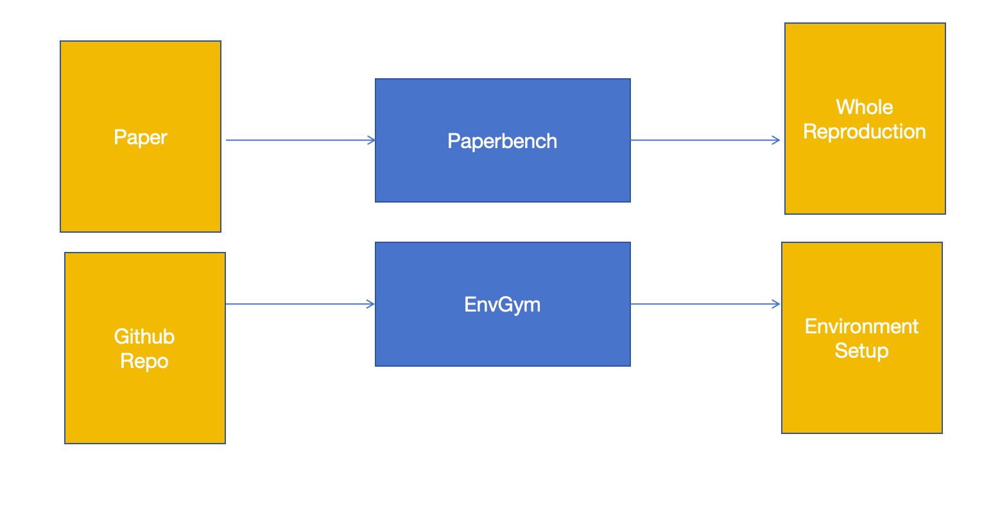

# EnvGym

## System requirements

Install pre-requisites

```bash
for proj in nanoeval alcatraz nanoeval_alcatraz; do
    pip install -e project/"$proj"
done
```

## Pipeline Introduction



### Issues in the Original Version（Apr18）

1. **Code Quality vs. Generation Time**  
   During local testing, we observed that the quality of the generated code does not correlate directly with the generation time. In some cases, a complete environment was generated within 6 minutes, while in others, after 18 minutes, no meaningful output was produced.  
   The `generation time` is controlled by the configuration file located at:  
   `/project/paperbench/paperbench/agents/aisi-basic-agent/config.yaml`.

2. **Environment-Only Generation Approach**  
   The first version did not directly generate only the environment and stop in advance. Instead, it generated the entire repository first, then cropped the environment-related parts after a predefined time limit. This was necessary because the original repository included feedback processes where code could modify the environment during generation.

---

## Modifications

1. **New Pipeline and Storage**

   - Added `/project/paperbench/pipeline.py` for a dedicated environment extraction pipeline.
   - Added a new directory `/project/paperbench/env_only/` to store the environment-related scripts and README files.
   - To run:
     ```bash
     cd project/paperbench/
     python pipeline.py
     ```
     The generated files related to the environment will appear in the `env_only` folder.

2. **Rubric Tree Simplification**

   - Modified the default rubric tree at:  
     `/project/paperbench/data/papers/rice/rubric.json`
   - Now, the rubric tree only contains branches and leaves related to environment setup.

3. **Customizable Dataset Split**
   - Updated the dataset split configuration file:  
     `/project/paperbench/experiments/splits/debug.txt`
   - By default, it uses the "rice" dataset.
   - You can replace "rice" with any custom dataset name to adapt to new data.

---

## Roadmap

### T0: Preparation Phase

- **Input Adjustment:**  
  Preprocess the GitHub repository dataset to match the current system:

  - Replace `paper.md` with the repository's `README.md`.
  - Replace `addendum.md` with the main project code files.

- **Output Definition:**  
  In the next version, use a new agent to directly generate a full Conda environment or Dockerfile based on the environment-related outputs.

---

### T1: Automation of Rubric Tree Generation

- Use an agent to automatically construct the rubric tree structure based on the repository contents.

---

### T2: Generation Time Optimization

- Determine a suitable generation time parameter for future demos and experiments.

---
